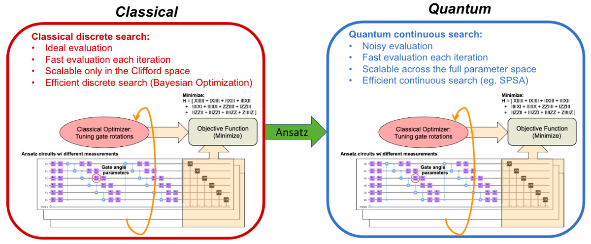
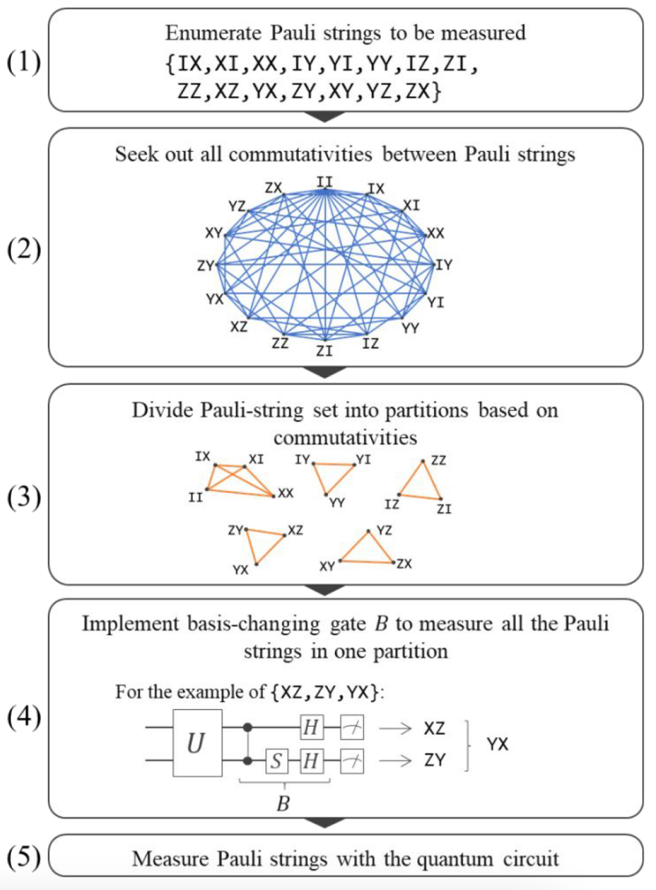
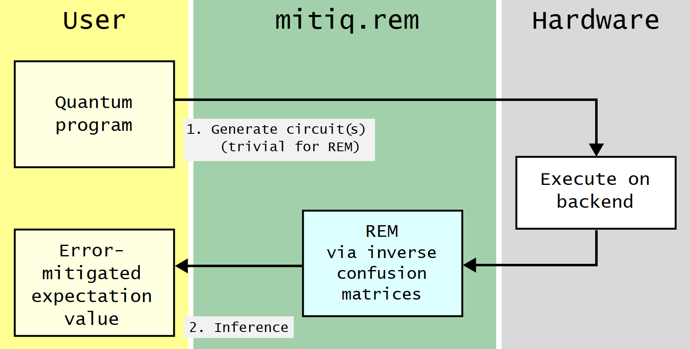

# QCfDD: 2023 Quantum Computing for Drug Discovery Challenge at ICCAD


**Hengrui Chen, Tianze Zhu, Yizheng Fang, Yifan Guo (Zhejiang University)**


**Attention: due to the large file limit of Github, we didn't upload three files (e.g., `mitigator_cairo.pickle`). These three pickle files can be easily generated in python, and they store the class `CorrelatedReadoutMitigator` in Qiskit. You can contact us if you had doubts about our work.**


## Introduction

## Overview of Requirements

We strongly recommend running code on Linux x86_64.

We use Anaconda or Miniconda to create a virtual environment, and we recommend using the latest version of `conda`.

```shell
conda create -n qcfdd python=3.9
conda activate qcfdd
```

Continue to use pip to install the required environment.

```shell
pip install -r requirements.txt
```

The `pip install` process on Ubuntu 22.04 LTS is very smooth. The installation on MacOS (especially on Macs with M chips) may encounter some difficulties when building GPy. You can try the following commands.

```shell
pip install scipy
pip install -r requirements.txt
```

We do not recommend execute this application on Windows, so we did not test the installation proces on Windows.

## Steps to execute the code

### Single Execution (Only for Testing)

We provide the optimal circuit for each noise model rendered in `QASM` format and the corresponding optimal parameters. The notebook `illustration.ipynb` describes the process of loading circuits with optimal parameters and running VQE. You can easily modify the values of various hyperparameters, such as `seed`, `shots`, etc.

We decided to move away from using the `qiskit_aer.primitives.estimator.Estimator` due to the necessity of extensive involvement in the VQE process. This includes the integration of optimizations such as error mitigation and the configuration of initial parameter settings. As a result, we opted to reimplement the VQE process. Similar to the usage of the `Estimator`, we employ the `AerSimulator` for noisy simulations. Recognizing that the `Estimator` offers the `run_options` feature, particularly with the `seed` option, we have implemented similar testing functions for testers. **Testers are encouraged to utilize the `test` function to evaluate the performance across various seeds using different noise models. The final result is determined by averaging the estimated energy values.**

### Full Execution

If you want to view the complete iteration process of VQE, `main.py` is the entry point of the program.

`main.py` provides a wealth of optional parameters for various configurations during program execution. Please understand the meaning of each parameter through `python main.py -h` before running.

For convenience, you can directly run the scripts in `./shell`, we have already set excellent hyperparameters for you under different noise models.

## Technical Reflection & Description

### CAFQA

[CAFQA](https://dl.acm.org/doi/10.1145/3567955.3567958) addresses the crucial challenge of identifying an effective ansatz initialization, specifically tailored for a **C**lifford **A**nsatz **F**or **Q**uantum **A**ccuracy.

In quantum computing, when operations are restricted solely to: a) Clifford group gates, b) measurements of Pauli group operators, and c) Clifford group operations conditioned on classical bits, potentially derived from prior measurements, it is possible to achieve perfect simulation using a probabilistic classical computer within polynomial time. This insight naturally leads us to contemplate the prospect of simulating the Variational Quantum Eigensolver (VQE) process efficiently in a noise-free environment, thereby obtaining exceptional initialization parameters. These parameters, in turn, can be harnessed for executing VQE on a quantum computer.

The accompanying figure illustrates the comprehensive CAFQA procedure. In the noise-free simulation phase, our exploration is confined to the Clifford space, facilitating the rapid acquisition of high-quality parameters within polynomial time. When transitioning to VQE execution on a quantum computer, where the entire parameter space is explored, the utilization of these superb initialization parameters translates to fewer iterations required to attain the optimal solution.



**In our experimental process, we first use CAFQA to obtain initialization parameters, and then run VQE on a noisy simulator to obtain the parameters of the lowest energy point. The parameters have been bound to the transpiled circuit and stored in the QASM file.**

### Weight-Aware Quantum Resource Allocation Optimization

To enhance the quantum resource utilization efficiency of our program, we have devised and implemented a resource allocation strategy grounded in the weights (coefficients) associated with the expectations of Pauli strings during energy computation. Given that all Pauli strings exhibit similar circuit depths (and qubit counts), we gauge quantum resource allocation by measuring the execution shots required for a quantum circuit.

As depicted below, due to the substantial variations in weights among different Pauli strings, it is impractical to distribute quantum computing shots uniformly across all Pauli strings. An intuitive approach involves allocating more shots to Pauli strings with higher weights (e.g., "IZIIIIIIIIII"), and inversely so.

To optimize our resource allocation to the highest degree possible, we undertake a thorough theoretical and quantitative analysis, as outlined below.

Drawing from the central limit theorem, we can infer that the mean error $e_i$ associated with measuring string $P_i$ for $N_i$ shots is proportional to $\frac{1}{\sqrt{N_i}}$. Considering the formula $Energy=\sum_i Expectation_i \times coefficient_i$, our goal is to ensure that every term exhibits errors on a similar scale. To achieve this, we endeavor to satisfy the condition: $coefficient_i \times \frac{1}{\sqrt{N_i}}=const$ for every term $i$. Consequently, we derive an optimally theoretical shot allocation approach: let $N_i=\left\lfloor k\times coefficient_i^2\right\rfloor$, where $k$ is a global constant.

Guided by our quantitative allocation methodology, in conjunction with considerations for classical computing time and experimental validation, we propose the most suitable quantum resource allocation strategy for our problem:
- Measure the Pauli string `"ZZZZZZZZZZZZ"` for the Pauli strings in the corresponding partition (`'IIIIIIIIIIII'`, `'ZIIIIIIIIIII'`, `'IZIIIIIIIIII'`,..., `'ZIIIIIZIII'`,etc.), and measure for 700 shots.
- Depending on the specific noise model and hyperparameters chosen, judge which of the other Pauli partition groups are to be measured, with the number of shots measured in decreasing order: 1036, 446. 


### Pauli String Grouping (Partition) Technique

#### Overview

One of the main methods proposed to suppress an increase in the number of measurements is the partitioning (grouping) method, where Pauli strings are partitioned so that their expectation values can be measured simultaneously. 

In this method, a group of Pauli strings is divided into subgroups, and all the components of each subgroup are measured simultaneously using only one circuit (hereafter, such subgroups are called “partitions”). 

#### Theory Background

A simultaneous measurement is based on the fact that the expectation values of two Pauli strings $𝑃_1$ and $𝑃_2$ can be simultaneously estimated by applying an appropriate basis-changing operation if and only if they commute each other (i.e., $𝑃_1𝑃_2 = 𝑃_2𝑃_1$)

To maximize the effectiveness of simultaneous measurement, the number of partitions should be minimized.

The following figure shows a scheme for measuring the expectation values of multiple Pauli strings using simultaneous measurement and partitioning. 



After enumerating the Pauli strings that are required to estimate the expectation values (step (1)), the commutativity of each pair of Pauli strings was checked (step (2)). Then, we created partitions where all Pauli strings commute (step (3)). Based on this, we determined the basis-changing gate B for each partition (step (4)), and finally, all the expectation values of the Pauli strings were estimated (step (5)). Using steps (2) and (3) presented in Figure 1, the number of circuits was reduced to the number of partitions.

#### Implementation

The problem of Pauli string grouping can be broken down into two parts:
1. The partition of a given group of Pauli strings.
2. The method to get the equivalent measurement results of pauli strings in a partition from the result of the so-called "simultaneous measurement" 

We solve the first part (the partition) of the problem by calling the method in the `qiskit.Estimator`, and we tackle the second part (simultaneous measurement) by using the functions: `get_pauli_expectations`, `count_to_exps`, `get_group_exp`. 

Below is the streamlined workflow for our simultaneous measurement process:

1. The measurement result on the Pauli string (e.g., `"ZZZZZZZZZZZZ"`) and the accompanying data pertaining to the corresponding Pauli string group (e.g., `['IIIIIIIIIIII', 'IZIIIIIIIIII', ...]`) are transmitted to the `count_to_exps` function.

2. Within the `count_to_exps` function, the aforementioned measurement result, along with each Pauli string in the group (partition), is supplied to the `get_ground_exp` function.

3. In the `get_ground_exp` function, computations are performed to derive the corresponding equivalent measurement result from the original measurement outcome. Furthermore, the expectation value of the Pauli string is computed and, if applicable, mitigated when the rem mitigator is not None. 

### Tranpilation Optimization

We employ transpilation optimization techniques to enhance performance effectively. Fortunately, Qiskit provides a built-in function called `transpile` for this purpose. We set the `optimization_level` to 3 to apply *even heavier optimization*, aiming to minimize the impact of circuit decoherence and quantum gate noise to the greatest extent possible.


### Readout Error Mitigation

#### Overview

Readout-Error Mitigation (REM) is an error mitigation technique in which inverted transition/confusion matrices are applied to the noisy measurement results.

The technique is based on two main ideas:

1. Generating a confusion matrix for a specific device;

2. Computing the psuedoinverse of this confusion matrix and applying it to the raw measurement (or “readout”) results.

#### Implementation

##### Measurement based method

The readout mitigator is generated from an assignment matrix: a $2^n \times 2^n$ matrix A such that $A_{y,x}$ is the probability to observe y given the true outcome should be x. The assignment matrix is used to compute the mitigation matrix used in the readout error mitigation process itself.

A Correlated readout mitigator uses the full $2^n \times 2^n$ assignment matrix. 

We use correlated readout mitigation in our program for better accuracy.

we can get the mitigator(derived from assignment matrix) by the following measurement and process procedure:

```python
exp = LocalReadoutError(qubits)
for c in exp.circuits():
    print(c)
result = exp.run(backend,run_options{"seed": seed})
mitigator = result.analysis_results(0).value
```

After we get the mitigator, it's easy to calculate the mitigated expectation value of a diagonal observable (namely a Pauli string) from the measurement result:
`expectation=mitigator.expectation_value(data=measurement_count, diagonal=pauli,  shots=shots)`

##### Noise model based method

the figure below shows how to use REM by `mitiq.rem`.



Since the estimated confusion matrix A is circuit-independent—it characterizes the readout noise of the device regardless of what circuit is being executed, we can get matrix A directly from the noise model.

We can obtain the mitigator by: `mitigator = qiskit.result.CorrelatedReadoutMitigator(assignment_matrices=matrix_A)`.


### Zero Noise Extrapolation (ZNE)
The figure below shows the main procedure of ZNE mitigation method:


#### Overview
Zero noise extrapolation (ZNE) is an error
mitigation technique used to extrapolate the noiseless expectation value of an
observable from a range of expectation values computed at different noise levels.
This process works in two steps:

- **Step 1: Intentionally scale noise**. This can be done with different methods.
*Pulse-stretching*  can be used to increase the noise level of a quantum computation. Similar results can be obtained, at a gate-level, with *unitary folding* or *identity insertion scaling*.

- **Step 2: Extrapolate to the noiseless limit**. This can be done by
fitting a curve (often called *extrapolation model*) to the expectation values measured at different noise levels to extrapolate the noiseless expectation value.


#### Implementation

##### First Step: Generating noise-scaled quantum circuits

  - We provide a `QPROGRAM`, i.e., a `QuantumCircuit` defined by Qiskit.
  - Mitiq generates a set of noise-scaled circuits by applying a scaling method (*unitary folding* or *identity insertion scaling*) with different scale factors.
  - The noise-scaled circuits are executed on the noisy backend obtaining a set of noise-scaled expectation values.

##### Second Step: Inferring the zero-noise value from the measured results

  - A parametrized curve is fit to the noise-scaled expectation values obtained in step one.
  - The curve is extrapolated to the zero-noise limit, obtaining an error mitigated expectation value.

##### The optimization of parameters for ZNE

There are three key parameters in ZNE that can affect its performance: 
- the scale factors: a list of numbers which dictate the scales of the noise in quantum circuits, i.e., [1, 2, 3]
- the noise scale functions (which inserts gates into original circuit to scale the noise)
  - To apply ZNE, we need to effectively increase the noise acting in a quantum computation. We can achieves this task by digital noise scaling, i.e., with circuit manipulations that indirectly increase the effect of noise but keep the circuit logic unchanged.
  - There are two available methods to scale noise: inserting unitaries and inserting layers of identity gates. 
- the extrapolation method (we represented it as Factory objects). its key tasks:
  - Record the result of the computation executed at the chosen noise level;
  - Determine the noise scale factor at which the next computation should be run; (optional)
  - Given the history of noise scale factors and results, evaluate the associated zero-noise extrapolation.

After multiple experiment alongwith complete theory analysis, we find the optimal hyperparameter combinations for every noise model:

- Montreal: scale factors =[1,3,5], noise scale function = zne.fold_all, extrapolation method = Richardson method
- Cairo: scale factors =[1,2,3], noise scale function = zne.fold_global, extrapolation method = Linear extrapolation method
- Kolkata: scale factors =[1,2,3], noise scale functions = zne.fold_global, extrapolation method = Linear extrapolation method

Here, we elucidate the theoretical underpinnings behind our selection of optimal hyperparameter combinations:

- The "zne.foldall" noise scale function is employed for local unitary gate folding, known for its substantial stability and resilience in the face of noise. This method strikes a well-balanced compromise between accuracy and computational speed, particularly when scale factors are set to [1, 3, 5] and the Richardson extrapolation method is applied. This particular combination is most suitable for backends characterized by low noise levels, such as the Montreal backend.

- In contrast, both the Cairo and Kolkata backends exhibit relatively high noise levels. In such scenarios, utilizing the noise scale functions "zne.fold_global" in conjunction with scale factors of [1, 2, 3] enhances sensitivity to variations in the noise scale of quantum circuits. Consequently, this combination yields superior error mitigation performance in noisy backends, with the added stability of the Linear extrapolation method ensuring consistent results.

### Experiment Results

Through the above techniques, we have greatly reduced the circuit size and measurement frequency, and achieved excellent results.

The final result of running scripts in `./shell` is as follows:

| Noise Model  |   Estimated Value    |      $E_{score}$      |
| :----------: | :------------------: | :-------------------: |
|  FakeCairo   | $-70.3515693475282$  | $94.57490020140841\%$ |
| FakeKolkata  | $-72.0927317050336$  | $96.91557657469684\%$ |
| FakeMontreal | $-75.96151014883753$ | $97.8835538694775\%$  |


